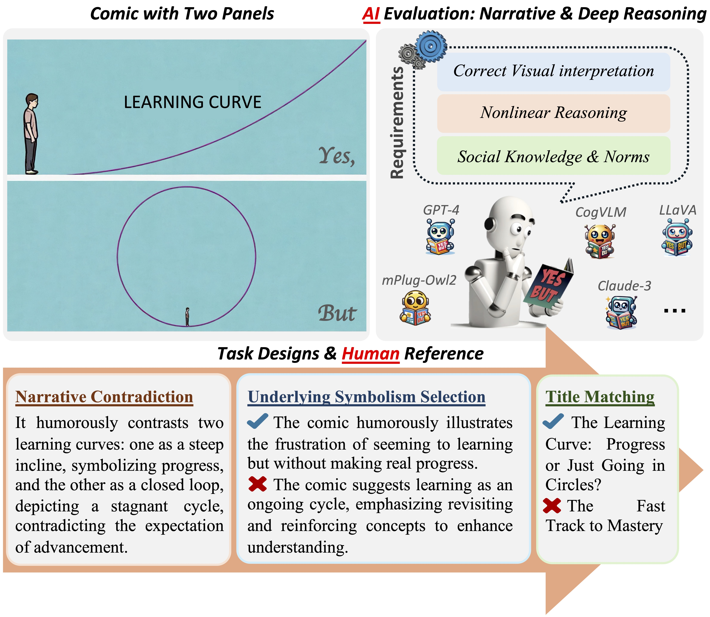

# When ‘YES’ Meets ‘BUT’: Can AI Comprehend Contradictory Humor in Comics?
This repository provides the official data release and code implementation of our paper:

**When ‘YES’ Meets ‘BUT’: Can AI Comprehend Contradictory Humor in Comics?**

Tuo Liang, Zhe Hu, Hao Zhang, Jing Li, Yiren Lu, Yunlai Zhou, Yiran Qiao, Disheng Liu, Jerui Peng, Jing Ma, Yu Yin


### [[Arxiv](TBD)] [[Webpage](TBD)] [[Dataset](https://github.com/Tuo-Liang/YESBUT_V2/blob/main/data/yesbut_v2.json)]

# Previous Work
**NeurlIPS Paper:** [YESBUT_v1](https://github.com/Tuo-Liang/YESBUT)

## Our Goal

We aim to challenge AI systems in their ability to recognize and interpret visual humor, grasp nuances in human behavior, comprehend wordplay, and appreciate cultural references. This understanding can enhance AI's ability to interact with users, generate creative content, and interpret multimedia content more effectively, thereby improving user experience in various applications such as content recommendation systems, virtual assistants, and automated content creation tools.

We collect and annotate images which convey various forms of visual humor and storytelling through simple comic panels. They explore themes such as human behavior, animal antics, and wordplay, often leading to unexpected or ironic conclusions.
<div align='left'></div>

## What we update comparing to [[YESBUT_v1](https://github.com/Tuo-Liang/YESBUT)]?
1. Expanded Dataset: YESBUT grows from 349 to 1,262 images, enhancing diversity and robustness for better VLM evaluation.
2. Comprehensive Evaluation: We assess various VLMs and LLMs, comparing general-purpose, reasoning-enhanced, and multi-image models.
3. Fine-grained Analysis: Statistical and ablation studies reveal key factors affecting humor comprehension and model failures.
4. Practical Improvements: We propose simple yet effective strategies to enhance VLMs' understanding of juxtaposition-based humor.


 
## Dataset

### Download
- Annotation File: The annotated data is available [here: data/YESBUT_v2.json](https://github.com/Tuo-Liang/YESBUT_V2/blob/main/data/yesbut_v2.json).

- Image Download: Download the associated images by running the following command:
```
python download_images.py --json_file='data/yesbut_v2.json' --save_folder='data/YesBut_images'
```
This will save the images to the specified `data/YesBut_images` folder.


### Annotated data format
- The file is in `/data/yesbut_v2.json`
- The file has the format such as following.
```
 {
    {
        "image_file": "00001.jpg",
        "description": "The comic is divided into two panels, each presenting a contradictory perspective of the same object—a mug. In the first panel, the mug is illustrated as an adorable fox with closed eyes, giving off a serene and cute vibe. It's an object that one would admire or find endearing. However, in the second panel, we see a person drinking from this fox-shaped mug. The contradiction lies in the mug's impracticality: its ears and head protrude awkwardly, obstructing the person's ability to sip comfortably. Despite its endearing appearance, the mug fails its primary function as a practical vessel for beverages.",
        "caption": "The comic is divided into two panels, each presenting a contradictory perspective of the same object—a mug. In the first panel, the mug is illustrated as an adorable fox with closed eyes, giving off a serene and cute vibe. It's an object that one would admire or find endearing. However, the second panel reveals a practical issue: a person attempts to drink from the fox-shaped mug, but its design—featuring protruding ears and head—awkwardly interferes, complicating the act of sipping comfortably.",
        "contradiction": "The comic illustrates a contradiction where a mug designed as an adorable fox is charming to look at but proves impractical to use due to its awkwardly protruding ears and head that hinder drinking.",
        "moral_mcq": "A. The comic implies that adding decorative elements enhances the aesthetic appeal, yet overlooks how they can detract from practicality and user experience.\n\nB. This illustration critiques the conflict between the aesthetics and utility of an object, emphasizing that a good object design needs to balance both to ensure a harmonious and practical experience in any aspect of life.\n\nC. The illustration implies that an object’s initial appeal guarantees satisfaction, despite possible functional drawbacks or discomfort encountered during its use.\n\nD. The image suggests enduring inconvenience is justified for owning something visually unique, emphasizing aesthetics over practicality and ease of use.",
        "moral_mcq_answer": "B",
        "title_mcq": "A. A Toast to Vulpine Grace\nB. Charming Design, Prickly Reality\nC. Enchanting Elixir: The Fox's Secret Brew\nD. Harmony in a Sip",
        "title_mcq_answer": "B",
        "social_info": "1. Aesthetic appeal can sometimes outweigh practicality in consumer choices.\n  2. Functional design is important for everyday usability.\n  3. The contrast between appearance and functionality can lead to humorous or frustrating situations.\n  4. Novelty items are often bought for their visual appeal rather than their practicality.+C2:C540",
        "Linguistic_context": "None",
        "Panel_Bounding_Boxes": "[[[32, 667], [1321, 2287]], [[1371, 674], [2663, 2287]]]",
        "Context_Bounding_Boxes": "[]",
        "contain_text": "no",
        "category": "This comic belongs to the category of daily life jokes where the humor lies in the functionality versus aesthetic dilemma of everyday objects. ### Daily Life joke",
        "link": "https://drive.google.com/file/d/1I1TSrHLoZNtK9Q-T6zIQBpT8kJHpI-1f/view?usp=drivesdk"
    }

```

## Experimental Design

### Experimental Setting
- Sample components: (image, caption, contradiction, symbolism, title)

#### Task 1: Description Generation
- Image Setting: p(description|image)
  
#### Task 2: Contradiction Generation
- Image Setting: p(contradiction|image)
- Full Setting: p(contradiction|image, caption)
	- oracle caption: written by annotators (upper bound)
 	- system caption: generated by VLM itself

#### Task 3: Title MCQ
- Image Setting: p(title_option|image)
- Full Setting: p(title_option|image, caption)
	- oracle caption: written by annotators (upper bound)
 	- system caption: generated by VLM itself

#### Task 4: Deep Philosophy MCQ
- Image Setting: p(Symbolism_option|image)
- Full Setting: p(Symbolism_option|image, caption)
	- oracle caption: written by annotators (upper bound)
 	- system caption: generated by VLM itself


## Evaluation
Modify the "predict_model_name.sh".
```
#Task claude3 as an example
data="annotated_data/data_annotation.json"
image_folder="YESBUT_cropped_yesbut"
write_path_surffix=".json"
#task options: contradiction | moral_mcq | title_mcq

use_caption=False

task="contradiction"
echo "==============================="
echo "claude3 eval"
echo "==============================="
python3 -u predict_claude_opus.py \
    --read_path ${data} \
    --write_path "results/results_claude3_"${task}"_"${write_path_surffix} \
    --task ${task} \
    --use_caption ${use_caption} \
    --image_folder ${image_folder}

```

Then run the command:
```
bash predict_model_name.sh
```

## Citation
```
@article{hu2024cracking,
  title={Cracking the Code of Juxtaposition: Can AI Models Understand the Humorous Contradictions},
  author={Hu, Zhe and Liang, Tuo and Li, Jing and Lu, Yiren and Zhou, Yunlai and Qiao, Yiran and Ma, Jing and Yin, Yu},
  journal={arXiv preprint arXiv:2405.19088},
  year={2024}
}

```


